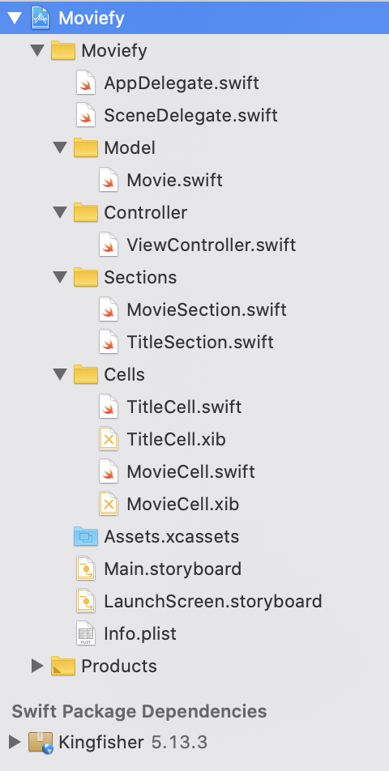
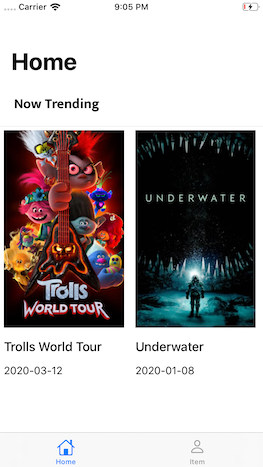

1. Look at The Movie DB (TMDb) API
1. **Get to know the current state of the project**
    1. **Looking at the file structure** 
    1. **Exploring existing files** 
1. Model the response
1. Work with Swift API Client
1. Handle network errors 
1. Create HTTP methods and routes
1. Configure the request
1. Implement Encoder 
1. Handle the response
1. Make the call 
1. Display the data 


# Project Setup with Xcode

> [action]
> Download the starter code [here](https://github.com/amelinagzz/moviefy-starter)
>
> Open the project in Xcode and run the simulator to make sure it builds

Currently the UI is built with Xib with very simple constraints. Feel free to explore the UI but try to resist the temptation to make complex or good looking UI this early.

The current file structure should look like the following:




# Exploring the Current Files

We are using MVC architecture in this project. MVC stands for Model, View, Controller. The current project is ordered with a Model folder, a Controller folder, and 2 View folders separating Sections and Cells. 

## Model 
```swift
// Movie.swift

struct Movie {
    let id: Int
    let title: String
    let posterPath: String
    let releaseDate: String
}
```
In the `Movie.swift` file, we have a Movie struct that contains 4 properties: id, title, posterPath, and releaseDate. 

> [info]
> Structs are complex data types, meaning that they are made up of multiple values. You then create an instance of the struct and fill in its values, then you can pass it around as a single value in your code.

## View 
> [info]
> The view files are what provides the user interface for the application. 

Lets take another look at what the finished product should look like: 



The view files are made up of `TitleCell.swift` and `MovieCell.swift` and their associated `.xib` files.

From the image, _Now Trending_ is made from the `TitleCell` and each of the movies listed below the title are reused `MovieCell` whose content is populated from the `Movie` struct.

> [info]
>The **Sections** are what configures the various cells together into the UI.

## Controller

The project has a single `ViewController.swift` file whose content fills the main window. 

> [info]
> A view controller acts as an intermediary between the views it manages and the data of your app. The methods and properties of the UIViewController class let you manage the visual presentation of your app. When you subclass UIViewController , you add any variables you need to manage your data in your subclass.

## Library

We will be using the [Kingfisher](https://github.com/onevcat/Kingfisher) library for downloading and caching images of the movies from the web.

# Set up Git/GitHub

>[action]
> Make your first commit
>
```bash
$ git init
$ git add .
$ git commit -m 'project init'
```

Now go to GitHub and create a public repository called `Moviefy`, and now associate it as a remote for your local git project and then push to it.

>[action]
> Push it!
>
```bash
$ git remote add origin GITHUB-REPO-URL
$ git branch -M main
$ git push -u origin main
```
